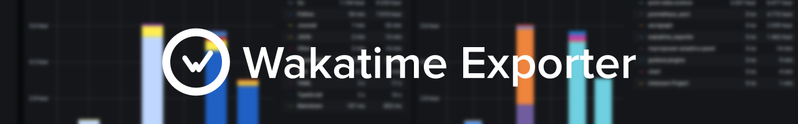
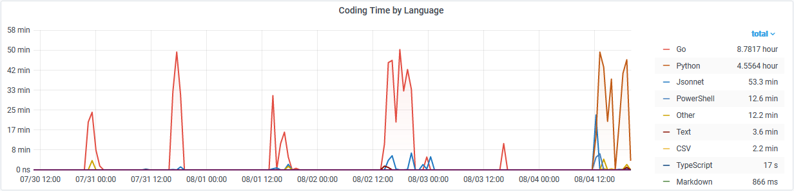

<a href="#"></a>
<h2></h2>
<p align="center">
  <a href="#" target="blank">
    
  </a>
  <a href="https://hub.docker.com/r/macropower/wakatime-exporter" target="blank">
    
  </a>
  <a href="https://hub.docker.com/r/macropower/wakatime-exporter" target="blank">
    
  </a>
  <a href="https://goreportcard.com/report/github.com/MacroPower/wakatime_exporter" target="blank">
    
  </a>
  <a href="https://codeclimate.com/github/MacroPower/wakatime_exporter/maintainability" target="blank">
    
  </a>
</p>

_wakatime_exporter_ is a Prometheus exporter for Wakatime statistics. It intends to extend the existing Wakatime ecosystem via allowing users to make use of Prometheus (and therefore any consumers of its API) as companion services alongside the traditional Wakatime web application. This could be anything from including some of your coding statistics in Grafana, to forecasting your coding time with prophet. Sky's the limit!

> NOTE: _wakatime_exporter_ is currently in ALPHA. Expect things to break and change.

[Click here](METRICS.md) to see an example of the exported metrics.

[Click here](https://grafana.com/grafana/dashboards/12790) for a simple dashboard you can use to get started.

<a href="#"></a>

## Usage

In most cases, you should only need to provide an API key.
All other parameters are for advanced use-cases only and you should be able to leave them set to their defaults.

You can get your Wakatime API key by visiting: https://wakatime.com/api-key

Provide arguments via parameters:

```text
usage: wakatime_exporter --wakatime.api-key=WAKATIME.API-KEY [<flags>]

Flags:
  --help                               Show context-sensitive help.
  --web.listen-address=":9212"         Address to listen on for web interface and telemetry.
  --web.telemetry-path="/metrics"      Path under which to expose metrics.
  --wakatime.scrape-uri="https://wakatime.com/api/v1"
                                       Base path to query for Wakatime data.
  --wakatime.user="current"            User to query for Wakatime data.
  --wakatime.api-key=WAKATIME.API-KEY  Token to use when getting stats from Wakatime.
  --wakatime.timeout=5s                Timeout for trying to get stats from Wakatime.
  --wakatime.ssl-verify                Flag that enables SSL certificate verification.
  --log.level=info                     Only log messages with the given severity or above.
                                       One of: [debug, info, warn, error]
  --log.format=logfmt                  Output format of log messages.
                                       One of: [logfmt, json]
  --version                            Show application version.
```

and/or via environment variables:

```
WAKA_LISTEN_ADDR=":9212"                      # Address to listen on for web interface and telemetry.
WAKA_METRICS_PATH="/metrics"                  # Path under which to expose metrics.
WAKA_SCRAPE_URI="https://wakatime.com/api/v1" # Base path to query for Wakatime data.
WAKA_USER="current"                           # User to query for Wakatime data.
WAKA_API_KEY=""                               # Token to use when getting stats from Wakatime.
WAKA_TIMEOUT="5s"                             # Timeout for trying to get stats from Wakatime.
WAKA_SSL_VERIFY="true"                        # SSL certificate verification for the scrape URI.
```

## Docker

```shell
docker run -p 9212:9212 macropower/wakatime-exporter:latest --wakatime.api-key="YOUR_API_KEY"
```

## License

This project was licensed GPL-2.0 from 0.0.0 to 0.0.5.

As of 0.0.6, parts of this application use code from node_exporter, which is licensed APACHE 2.0.

As of 0.0.6, this project in its entirety, excluding any packages found in vendor, is licensed APACHE 2.0.
Each file in this project has a license header which identifies the copyright for said file.
